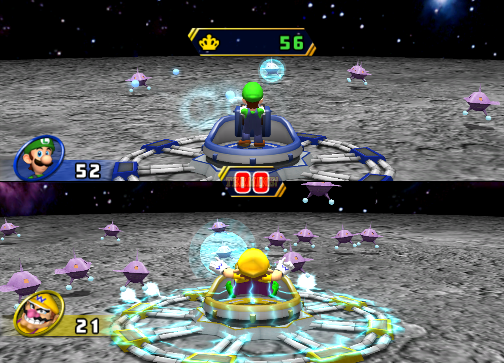

# 3D Space Invaders

## Summary
A homage to the classic game Space Invaders. The player rotates on a fixed point has a laser to shoot the space invaders. 
The goal of the game is to eliminate all the enemies and avoid taking damage to get the highest score. 
The invaders will also shoot projectiles at the player, so the player will have to do their best to dodge these projectiles and avoid taking damage.

The player will be situated on a platform and must defend against invaders as they circle in on the platform and player, 
similar to the Mario Party minigame Saucer Swarm, shown below.

## Advanced Topics
- Collision Detection
  - We will detect collisions between:
    - the player’s bullets and the enemies
    - The enemy and enemy bullets and the player
- Shadows
  - A light will shine on the space invaders from an angle and there will be shadows on the invaders and the platform that the player is located on as a result

## Roles
- Amy Tu
  - Shadow mapping
  - Music
  - Modeling
- Benjamin Yang
  - Enemy/laser movement
  - Sound effects
  - Collision detection
- Kevin Chuang
  - Game logic
  - Heads-up display
  - Controls and camera smoothing

## Instructions
To start the server: 
On Windows, run `host.bat`. 
On Mac/Linux, run `host.command`.

To play the game after starting the server, navigate to `localhost:8000`. 
Press `p` to start the game. The `a` and `d` keys are used to rotate the view left and right. 
The `v` key is used to shoot a laser. Once the game has ended, press `p` to restart. 