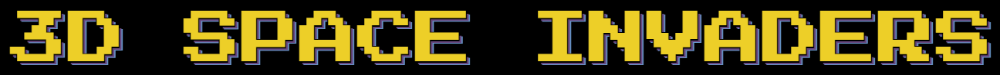

# 

## Summary
A homage to the classic game Space Invaders. The player defends a fortress that is armed with a laser with which to shoot the space invaders. The invaders will circle in on the player as depicted below.
The goal of the game is to eliminate enemies and avoid taking damage for as long as possible in order to get the highest score. 
The invaders can damage the player via direct contact or poisonous balls of goo, the later of which the player must put up a shield for to avoid taking damage.

The player loses when they no longer have any lives left.

## Advanced Topics
- Collision Detection
  - We detect collisions between:
    - the player’s bullets and the enemies
    - The enemy and enemy "bullets" and the player
- Shadows
  - A light shines down from above, casting shadows on the invaders, platform, and player as a result

## Roles
- Amy Tu
  - Shadow mapping
  - Music
  - Modeling
- Benjamin Yang
  - Enemy/projectile movement
  - Sound effects
  - Collision detection
- Kevin Chuang
  - Game logic
  - Heads-up display
  - Controls and camera smoothing

## Instructions
To start the server: 
On Windows, run `host.bat`. 
On Mac/Linux, run `host.command`.
To play the game, navigate to `localhost:8000` on your web browser (Google Chrome recommended). 

### Controls
Press `p` to start the game. The `a` and `d` keys are used to rotate the view left and right. 
The `v` key shoots a laser. 

Press `s` to toggle shield and block enemy projectiles. Note that you cannot shoot lasers while shielding. 

Once the game has ended, press `p` to restart. 
